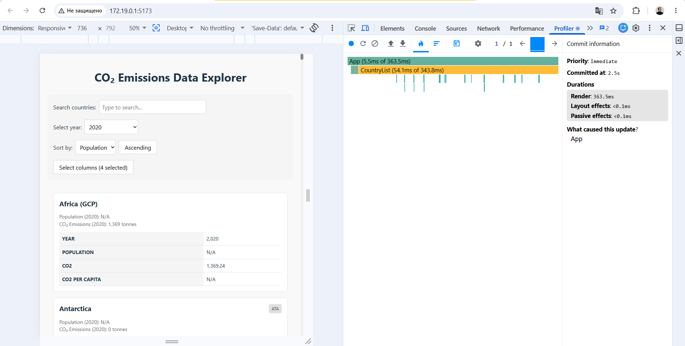
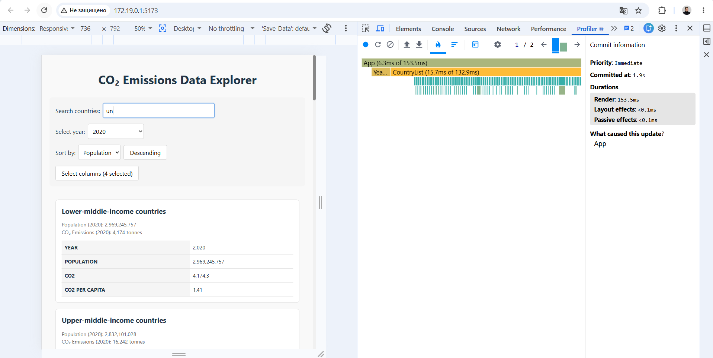
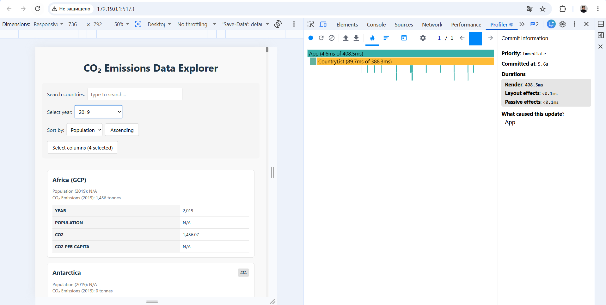
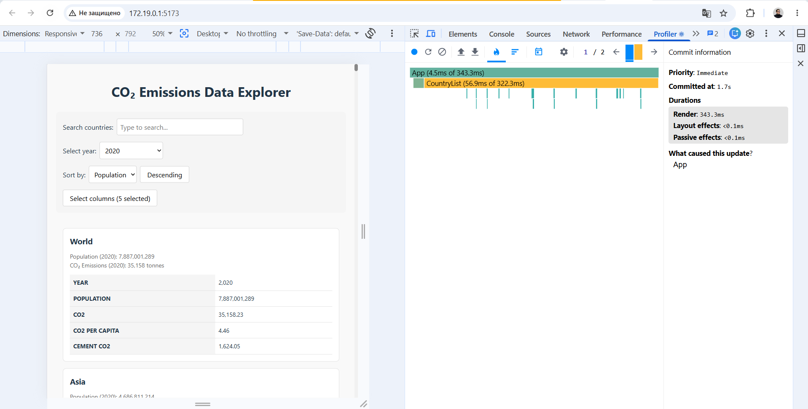

# Performance Report

## Baseline

Profiled the starter in dev mode (`npm run dev`) with React DevTools - Profiler.
For each action I recorded one commit and took the "Render" duration from the Commit information panel. Full dataset (200+ countries).

In every case the update starts at `App` and re-renders the whole `CountryList`, which is where almost all the time goes.

### Sorting

Toggled the sort order (Population).

- Render: **363.5 ms** (CountryList 343.8 ms)

### Searching

Typed `un` in the search box.

- Render: **153.5 ms** (CountryList 132.9 ms)

Lower than the others because the list is already filtered down, but every
keystroke still re-renders all visible cards.

### Year

Changed the year to 2019.

- Render: **408.5 ms** (CountryList 388.3 ms)

### Columns

Toggled one column in the Select columns modal.

- Render: **343.3 ms** (CountryList 322.3 ms)

### Summary

| Action | Render (ms) | CountryList (ms) |
| --- | --- | --- |
| Sorting | 363.5 | 343.8 |
| Searching | 153.5 | 132.9 |
| Year | 408.5 | 388.3 |
| Columns | 343.3 | 322.3 |

The whole list re-renders on every interaction, every card rebuilds its data, and nothing is memoized or virtualized. That is what the next part fixes.

## Optimizations

TODO

## Results

TODO
